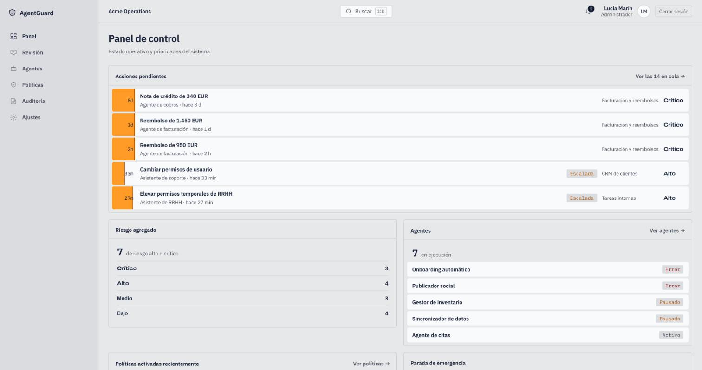
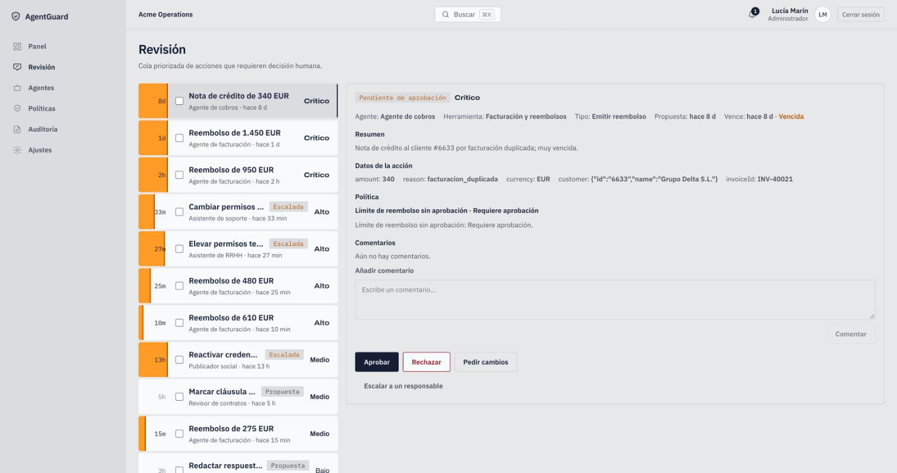
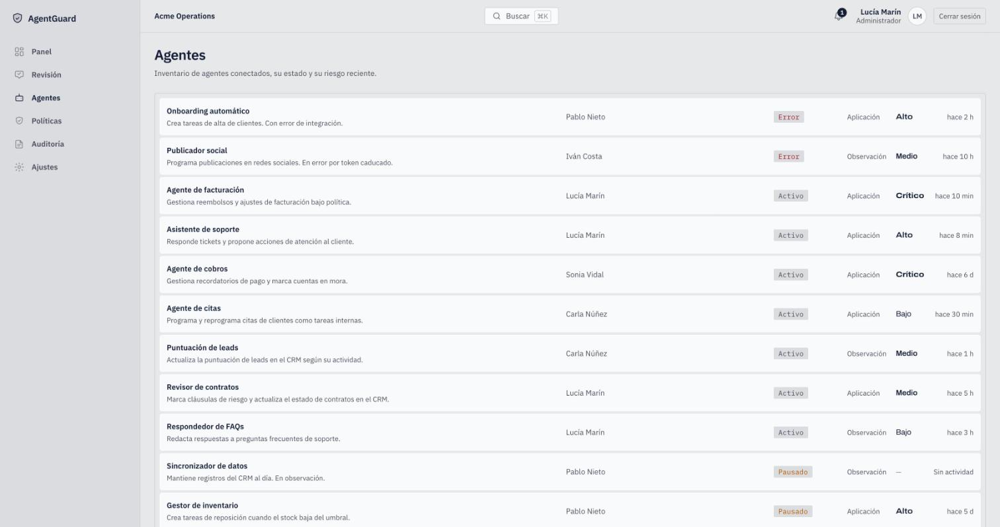
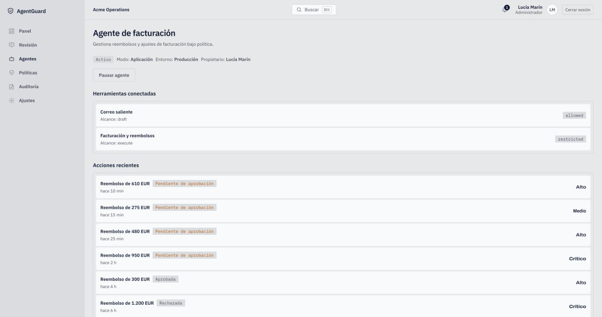
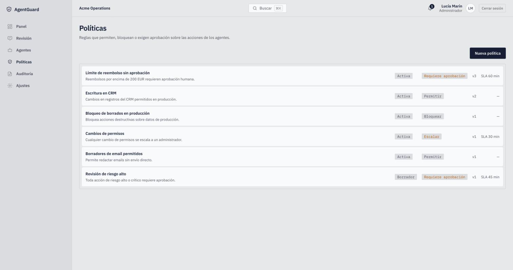

# AgentGuard

Plano de control para empresas que usan agentes de IA. Cada acción que un
agente propone pasa por AgentGuard, donde se evalúa contra políticas, se
aprueba o rechaza si hace falta, se ejecuta y queda registrada en un log de
auditoría inmutable.

El proyecto arrancó como un MVP con datos simulados y ha evolucionado hasta
una aplicación de extremo a extremo: persistencia en PostgreSQL,
autenticación con control por rol, ingesta de acciones vía API, ejecución con
reintentos y notificaciones por email y Slack.

## Qué hace

- **Cola de revisión**: acciones pendientes con nivel de riesgo, contexto y
  payload; aprobar, rechazar, pedir cambios o escalar, de una en una o en lote.
- **Políticas**: reglas por tipo de acción, herramienta y riesgo que deciden
  si una acción se permite, se bloquea o necesita aprobación humana, con SLA
  de respuesta y escalado automático al vencer.
- **Inventario de agentes**: estado, herramientas conectadas, pausa y
  reanudación individual, claves de API para la ingesta.
- **Parada de emergencia**: interruptor a nivel de organización que congela
  toda ejecución al instante.
- **Auditoría**: registro de cada decisión y cambio de configuración,
  exportable a CSV y JSON.
- **Roles**: administrador, revisor, auditor y desarrollador, con permisos
  distintos sobre cada pantalla.
- **Notificaciones**: in-app, email (Resend) y Slack (webhook).
- **Command palette** (`⌘K`) para navegar y actuar sin ratón.

## Capturas

**Panel de control**: acciones pendientes ordenadas por urgencia, riesgo agregado y estado de los agentes.



**Cola de revisión**: lista priorizada con el detalle de la acción, su payload, la política que la retuvo y las decisiones disponibles.



**Agentes**: inventario con estado, propietario, modo y riesgo reciente; el detalle muestra herramientas conectadas y acciones recientes.





**Políticas**: reglas con efecto (permitir, bloquear, requerir aprobación, escalar), versión y SLA.



## Stack

- **Next.js 16** (App Router, Server Components y Server Actions) con
  **TypeScript** estricto.
- **PostgreSQL** + **Prisma 7**.
- Sesiones con JWT firmado (`jose`), contraseñas con `bcryptjs`.
- CSS custom con tokens en OKLCH; sin librería de componentes.
- **Vitest** para tests; ESLint y Prettier; CI en GitHub Actions.

## Requisitos

- Node.js 24 o superior.
- Una base de datos PostgreSQL. Cualquiera de estas opciones sirve:
  - Local: `npx prisma dev` levanta una sin instalar nada.
  - En la nube: Neon, Supabase o Prisma Postgres tienen plan gratuito.

## Instalación

```bash
git clone https://github.com/fcdev-28/agentguard.git
cd agentguard
npm ci
```

Copia la plantilla de variables de entorno y rellena al menos `DATABASE_URL`
y `AUTH_SECRET` (el resto son opcionales y están documentadas en el propio
fichero):

```bash
cp .env.example .env
openssl rand -base64 48   # pégalo como AUTH_SECRET
```

Aplica las migraciones y carga los datos de demostración:

```bash
npm run db:migrate
npm run db:seed
```

## Ejecución

```bash
npm run dev
```

Abre http://localhost:3000 e inicia sesión con cualquier usuario activo de la
demo. Todos comparten la contraseña `agentguard-demo`:

| Usuario                     | Rol           |
| --------------------------- | ------------- |
| `lucia.marin@acme.example`  | Administrador |
| `diego.ferrer@acme.example` | Revisor       |
| `marta.ruiz@acme.example`   | Auditor       |
| `carla.nunez@acme.example`  | Desarrollador |

Otros comandos:

| Comando                | Qué hace                          |
| ---------------------- | --------------------------------- |
| `npm test`             | Suite de tests (Vitest)           |
| `npm run lint`         | ESLint                            |
| `npm run format:check` | Prettier                          |
| `npm run build`        | Build de producción               |
| `npm run db:studio`    | Prisma Studio para inspeccionar   |

## Integrar un agente

Cada agente se autentica con una clave de API propia. Genera una para un
agente existente y envía acciones al endpoint de ingesta:

```bash
npx tsx scripts/create-agent-key.ts agt_support

curl -X POST http://localhost:3000/api/agent/actions \
  -H "Authorization: Bearer <api-key>" \
  -H "Content-Type: application/json" \
  -d '{
    "actionType": "send_email",
    "toolId": "tool_email",
    "title": "Enviar confirmación de pedido",
    "summary": "Correo al cliente con el resumen del pedido #4821",
    "riskLevel": "low",
    "payload": { "to": "cliente@example.com" }
  }'
```

La acción se evalúa contra las políticas activas y aparece en la cola de
revisión si alguna exige aprobación. Los detalles de despliegue (crons de
escalado y reintentos, URLs de Prisma, variables por entorno) están en
[`docs/DEPLOY.md`](docs/DEPLOY.md).

## Documentación

- [Resumen de producto](docs/PRODUCT.md)
- [Arquitectura UX](docs/UX_ARCHITECTURE.md)
- [Modelo de datos](docs/DATA_MODEL.md)
- [Estructura de aplicación](docs/APP_STRUCTURE.md)
- [Funcionalidades de control y velocidad](docs/FEATURES.md)
- [Roadmap](docs/ROADMAP.md)
- [Dirección de diseño](docs/DESIGN.md) y [sistema visual](docs/DESIGN_SYSTEM.md)
- [Notas técnicas](docs/TECHNICAL.md)
- [Despliegue](docs/DEPLOY.md)

## Licencia

[MIT](LICENSE).

## Autor

**Francisco Cañera**

- LinkedIn: [linkedin.com/in/fcanera](https://www.linkedin.com/in/fcanera)
- GitHub: [github.com/fcdev-28](https://github.com/fcdev-28)
